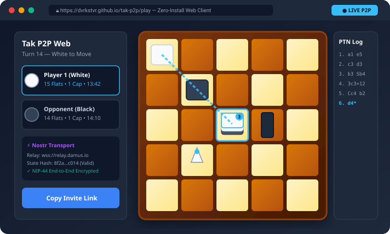
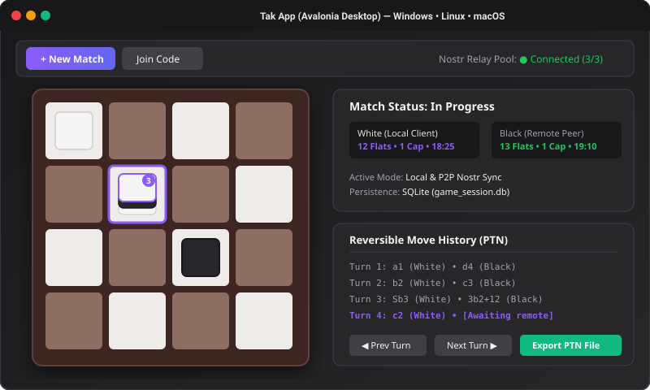
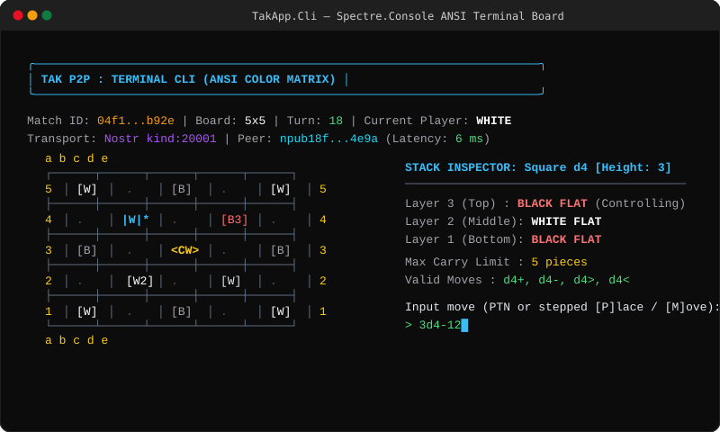
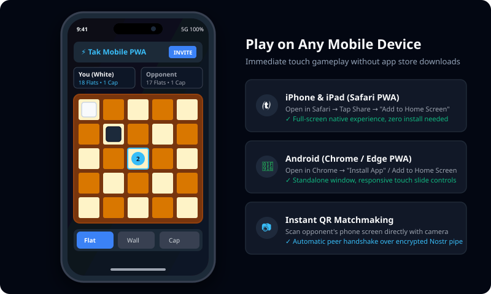

# Tak P2P: Decentralized Peer-to-Peer Tak

> A decentralized, peer-to-peer (P2P), zero-server implementation of the abstract strategy game **Tak**, supporting both synchronous (live) and asynchronous play across modern web browsers, Windows, Linux, macOS, Android, and iOS.

[](https://dvrkstvr.github.io/tak-p2p/)
[](https://github.com/Dvrkstvr/tak-p2p/releases)
[](tests/)
[](https://dotnet.microsoft.com/)
[](LICENSE)
[](https://nostr.com/)
[](src/)

---

## 🎮 Play Now in Your Browser (Zero Install)

You can play a full match of Tak right now without downloading or installing any software:

### 🚀 **[👉 Click Here to Launch the Live Web Client 👈](https://dvrkstvr.github.io/tak-p2p/)**
**URL:** [https://dvrkstvr.github.io/tak-p2p/](https://dvrkstvr.github.io/tak-p2p/)

* **No Accounts Required:** Deterministic Ed25519 identity keypairs are generated and stored locally in your browser.
* **Zero Game Servers:** Direct peer-to-peer communications over encrypted public Nostr relays.
* **Instant Matchmaking:** Share a 1-click web link (`/?invite=TAK1_...`) or dark-mode SVG QR code with a friend to play instantly.
* **Mobile & Desktop Ready:** Fully responsive touch and mouse controls with high-definition vector SVG rendering.

---

## 📦 Releases & Downloads

Pre-built standalone packages and binaries are automatically generated and published with every release on [GitHub Releases](https://github.com/Dvrkstvr/tak-p2p/releases):

| Package / Artifact | Platform | Format | Description | Quick Download |
| :--- | :--- | :--- | :--- | :--- |
| **Windows Desktop** | Windows 10 / 11 (x64) | `.zip` | Standalone GUI app (`TakApp.Avalonia.Desktop`) with hardware acceleration | [Download Windows App](https://github.com/Dvrkstvr/tak-p2p/releases/latest/download/tak-desktop-windows-x64.zip) |
| **Windows CLI** | Windows 10 / 11 (x64) | `.zip` | Terminal client (`TakApp.Cli`) with rich Spectre.Console ANSI interface | [Download Windows CLI](https://github.com/Dvrkstvr/tak-p2p/releases/latest/download/tak-cli-windows-x64.zip) |
| **Linux Desktop** | Ubuntu, Debian, Fedora, Arch, SteamOS | `.tar.gz` | Standalone Linux GUI app (X11 & Wayland native) | [Download Linux App](https://github.com/Dvrkstvr/tak-p2p/releases/latest/download/tak-desktop-linux-x64.tar.gz) |
| **Linux CLI** | Linux (x64) | `.tar.gz` | Terminal client for all POSIX terminal emulators | [Download Linux CLI](https://github.com/Dvrkstvr/tak-p2p/releases/latest/download/tak-cli-linux-x64.tar.gz) |
| **Android Native App** | Android Phones & Tablets (API 23+) | `.apk` | Native Android application (`TakApp.Avalonia.Android`) | [Download APK](https://github.com/Dvrkstvr/tak-p2p/releases/latest/download/tak-android.apk) • *(To be released on Google Play Store soon)* |
| **iOS & iPadOS Native App** | iPad & iPhone (iOS 13+) | Native Project | Native Avalonia iOS application (`TakApp.Avalonia.iOS`) | [Play Web PWA](https://dvrkstvr.github.io/tak-p2p/) • *(To be released on App Store soon)* |
| **Web PWA Client** | All Browsers (Desktop & Mobile) | WebAssembly | Instant zero-install play; installable as standalone PWA | [Launch Web Client](https://dvrkstvr.github.io/tak-p2p/) |

> *All release archives include corresponding `.sha256` checksum files for cryptographic verification.*

---

## 📱 Supported Devices & Methods of Play

Tak P2P is engineered with a strict **Separation of Concerns**—the deterministic core engine (`TakEngine.Core`) and peer-to-peer wire protocol (`TakEngine.Transport`) are decoupled from the user interface, enabling native performance across all major operating systems and web platforms.

### Overview Matrix

| Device / Platform | Method of Play | Technology | Implementation Status | Quick Launch / Access |
| :--- | :--- | :--- | :--- | :--- |
| **🌐 Web Browser** | Zero-Install Web Client (PWA) | Blazor WebAssembly (.NET 10) | 🟢 **Implemented** | [Launch Web Client](https://dvrkstvr.github.io/tak-p2p/) |
| **🪟 Windows PC** | Native Desktop App & Terminal CLI | Avalonia UI + Spectre.Console | 🟢 **Implemented** | [GitHub Releases](https://github.com/Dvrkstvr/tak-p2p/releases) (`tak-desktop-windows-x64.zip`) |
| **🐧 Linux** | Native Desktop App & Terminal CLI | Avalonia UI (X11/Wayland) + CLI | 🟢 **Implemented** | [GitHub Releases](https://github.com/Dvrkstvr/tak-p2p/releases) (`tak-desktop-linux-x64.tar.gz`) |
| **💻 MacBook / macOS** | Native Desktop App & Terminal CLI | Avalonia Desktop + Terminal CLI | 🟢 **Implemented / Compiles** | Cross-platform .NET 10 Desktop |
| **🤖 Android** | Mobile Web / PWA & Native App | Web PWA + Native APK (`TakApp.Avalonia.Android`) | 🟢 **Implemented** | [Download APK](https://github.com/Dvrkstvr/tak-p2p/releases/latest/download/tak-android.apk) *(To be released on App Store soon)* • [Chrome PWA](https://dvrkstvr.github.io/tak-p2p/) |
| **📱 iPhone & iPad** | Mobile Web / PWA & Native App | Safari PWA + Native iOS App | 🟡 **To be released on App Store soon** | [Play now via Safari PWA](https://dvrkstvr.github.io/tak-p2p/) • *(Native app to be released on App Store soon)* |

---

### Detailed Device Breakdown: What is Implemented vs. What is Missing

#### 1. 🌐 Web Client (Desktop & Mobile Browsers)
* **Method of Play:** Web application running client-side in the browser via WebAssembly (Blazor WASM).
* **Target Devices:** Any modern web browser (Google Chrome, Mozilla Firefox, Apple Safari, Microsoft Edge, Brave, Opera) on Windows, macOS, Linux, iOS, and Android.
* **✅ What's Already Implemented:**
  * Full Blazor WebAssembly compilation pipeline hosted permanently free on GitHub Pages.
  * Interactive vector SVG board supporting standard 4x4, 5x5, and 6x6 Tak board configurations.
  * 3D isometric piece stacks, standing walls, and capstones with dynamic height counters.
  * Real-time WebSocket connection to public Nostr relays (`wss://relay.damus.io`, `wss://nos.lol`, `wss://relay.primal.net`).
  * End-to-end payload encryption using NIP-44 ChaCha20-Poly1305.
  * Local hotseat play and instant peer-to-peer match invites via shareable links and QR tokens.
  * Reversible PTN move scrubber to review previous moves in the active match.
* **⏳ What's Missing / Next:**
  * Progressive Web App (PWA) Service Worker cache for 100% offline standalone usage.
  * IndexedDB storage bridge for indefinite local browser match archives.

#### 2. 🪟 Windows App
* **Method of Play:** Native desktop GUI (`TakApp.Avalonia`) and rich command-line interface (`TakApp.Cli`).
* **Target Devices:** Windows 10 and Windows 11 (x64 and ARM64).
* **✅ What's Already Implemented:**
  * Complete Avalonia MVVM desktop application (`TakApp.Avalonia`) with hardware-accelerated rendering.
  * Responsive board view, reserve inventory trays, turn indicator clocks, and PTN history panels.
  * Full local database persistence via SQLite (`SqliteGameStorage`) with fast $O(1)$ TPS state restoration.
  * Cryptographic state chain verification with SHA-256 and Ed25519 signature validation.
  * Spectre.Console interactive ANSI terminal client (`TakApp.Cli`) with conversational step inputs.
* **⏳ What's Missing / Next:**
  * Windows MSIX / InnoSetup installer package with start menu shortcuts.
  * Native Windows Action Center toast notifications when an opponent moves in an asynchronous match.
  * Seamless auto-updater service.

#### 3. 🐧 Linux App
* **Method of Play:** Native desktop GUI (`TakApp.Avalonia`) and rich terminal CLI (`TakApp.Cli`).
* **Target Devices:** Ubuntu, Debian, Fedora, Arch Linux, openSUSE, SteamOS / Steam Deck (X11 & Wayland).
* **✅ What's Already Implemented:**
  * Shared Avalonia Desktop UI running natively on Linux without emulation or wrappers.
  * Native terminal CLI (`TakApp.Cli`) featuring full ANSI color rendering and arrow-key menu navigation in all POSIX terminals.
  * Native SQLite storage and multi-relay WebSocket networking.
* **⏳ What's Missing / Next:**
  * Packaged distributions: Flatpak (`flathub`), AppImage, and Snap packages.
  * `libnotify` integration for desktop notification daemon alerts on opponent turns.

#### 4. 💻 MacBook / macOS App
* **Method of Play:** Native desktop GUI (`TakApp.Avalonia`) and Terminal CLI (`TakApp.Cli`).
* **Target Devices:** Apple Silicon (M1/M2/M3/M4) and Intel-based Macs running macOS 12 Monterey or newer.
* **✅ What's Already Implemented:**
  * Cross-platform Avalonia codebase targets .NET 10 desktop runtime with native macOS rendering support.
  * Reactive session observables and deterministic game rule verification.
  * Console app executes natively in macOS Terminal.app and iTerm2.
* **⏳ What's Missing / Next:**
  * Apple Developer ID codesigning and Gatekeeper notarization.
  * Self-contained `.app` application bundle packaged inside a `.dmg` installer.
  * Native macOS global menu bar integration and Dock badge indicators for pending moves.

#### 5. 🤖 Android App
* **Method of Play:** Native Android Client (`TakApp.Avalonia.Android`) and Mobile Web / PWA.
* **Distribution Status:** **Direct APK download available immediately** on GitHub Releases; official release coming to Google Play Store soon.
* **Target Devices:** Android smartphones, foldable devices, and tablets running Android 6.0+ (API 23+).
* **✅ What's Already Implemented:**
  * Dedicated native project head (`TakApp.Avalonia.Android`) using Avalonia UI for Android.
  * Direct `.apk` build capability via `dotnet build src/TakApp.Avalonia.Android/TakApp.Avalonia.Android.csproj`.
  * Touch-optimized UI with `IActivityApplicationLifetime` single-view lifecycle integration.
  * Custom adaptive app icon, splash screen animations, and high-DPI scaling for both phones and tablets.
  * `INTERNET` and `ACCESS_NETWORK_STATE` permissions configured in `AndroidManifest.xml` for resilient Nostr relay connectivity.
  * Mobile web PWA option running in Chrome/Firefox with 1-click home screen install.
* **⏳ What's Missing / Next:**
  * Google Play Store package release (`.aab` bundle).
  * Android background service for push-style turn notifications when app is suspended.
  * Haptic vibration feedback on piece placement and wall flattening.

#### 6. 📱 iPhone & iPad App
* **Method of Play:** Native iOS/iPadOS Client (`TakApp.Avalonia.iOS`) and Mobile Safari PWA.
* **Distribution Status:** **To be released on the Apple App Store soon**; play immediately with full-screen experience via Safari PWA ("Add to Home Screen").
* **Target Devices:** iPad and iPhone running iOS / iPadOS 13.0+.
* **✅ What's Already Implemented:**
  * Dedicated native project head (`TakApp.Avalonia.iOS`) using Avalonia UI for iOS.
  * Configured for **both iPad and iPhone** (`UIDeviceFamily = 1, 2`) with full landscape and portrait orientation support.
  * Single-view application lifecycle (`ISingleViewApplicationLifetime`) connecting directly to shared MVVM views.
  * Native compilation pipeline targeting iOS simulator and arm64 hardware devices.
  * Full-screen Safari PWA mode ("Add to Home Screen") for instant play with zero app store installation friction.
* **⏳ What's Missing / Next:**
  * Xcode project codesigning and Apple Developer provisioning profiles for App Store / TestFlight distribution.
  * Apple Push Notification service (APNs) integration for background match alerts.

---

## 🖼️ Interface Previews & Screenshots

### 1. 🌐 Web Client (Blazor WebAssembly)
> Zero-install web client running in any browser with live Nostr P2P matchmaking, SVG board rendering, and turn history.


### 2. 🪟 🐧 💻 Desktop Client (Avalonia UI)
> Hardware-accelerated desktop application on Windows, Linux, and macOS with local SQLite storage, game setup wizard, and move inspection.


### 3. 📟 Terminal CLI (Spectre.Console)
> Full ANSI terminal experience with interactive menus, 3D stack layer inspector, and conversational stepped input.


### 4. 📱 Mobile & PWA Experience (iPhone & Android)
> Responsive mobile design with touch drag-and-drop, slide distribution bars, and camera QR code token exchange.


---

## 🏛️ System Overview & Core Philosophy

### Architectural Invariants

* **Zero Authoritative Game Servers:** The network layer functions strictly as an encrypted "dumb pipe" / store-and-forward mailbox over Nostr relays. Clients never trust remote states; all moves and state transitions are verified deterministically on the local device.
* **Separation of Concerns:**
  * `TakEngine.Abstractions`: Shared contracts, immutable records, data structures (publicly distributed).
  * `TakEngine.Core`: Private game logic, DFS graph road traversal, cryptographic hashing, invariant checks, state storage.
  * `TakEngine.Transport`: Nostr WebSocket relay interface, NIP-44 encryption, envelope serialization.
  * Frontends (`TakApp.Avalonia`, `TakApp.Cli`, `TakApp.Blazor`): Pure UI views consuming reactive observables/events.
* **Deterministic Rule Adjudication:** Illegal moves are mathematically impossible to force onto a peer. If an opponent injects an invalid payload, the receiving client drops the payload and flags the peer.
* **Cryptographic State Hashing:** Every move entity strictly maintains a verifiable hash chain:
  $$\text{StateHash} = \text{SHA-256}(\text{PrevStateHash} \,\|\, \text{TurnIndex} \,\|\, \text{PlayerPubKey} \,\|\, \text{PtnMove} \,\|\, \text{TpsSnapshot})$$

---

## 📂 Repository & Solution Layout

```
TakGame.sln / TakGame.slnx
├── src/
│   ├── TakEngine.Abstractions/       # [Shared NuGet candidate]
│   │   ├── Enums/                    # PieceType, PlayerColor, Direction, GamePhase
│   │   ├── Models/                   # Coord, StackSnapshot, BoardSnapshot, TakMove, BroadcastModels
│   │   ├── ITakGameSession.cs        # Primary interface consumed by all frontends
│   │   └── ISpectatorGameSession.cs  # Spectator/broadcast observable interface
│   │
│   ├── TakEngine.Core/               # [Engine & Rules Core]
│   │   ├── Board/                    # Grid, Stacks, Piece Inventories, Move Execution
│   │   ├── Rules/                    # Invariant rules, Carry limits, DFS Road finder, MoveValidator
│   │   ├── Serialization/            # PTN (Portable Tak Notation) & TPS (Tak Positional System)
│   │   ├── Cryptography/             # Keypairs, Signatures, SHA-256 State Hashing
│   │   ├── Storage/                  # SQLite database engine, Match logs, Replay provider
│   │   └── Session/                  # TakGameSession, DelayedBroadcastQueue, SpectatorSession, NTP
│   │
│   ├── TakEngine.Transport/          # [Nostr P2P Infrastructure]
│   │   ├── Nostr/                    # WebSocket client, NIP-01/NIP-44 wrappers
│   │   ├── Matchmaking/              # Invite code parser, Ephemeral broadcast handler
│   │   └── TransportEnvelope.cs      # Signed wire models
│   │
│   ├── TakApp.Blazor/                # [Runnable Zero-Install Web Client]
│   │   ├── Components/               # TakBoardView (SVG), PieceStackSvg, SlideBar, Panels
│   │   ├── Pages/                    # Play.razor, Lobby, Settings
│   │   ├── wwwroot/                  # Static assets & GitHub Pages deployment
│   │   └── .github/workflows/        # Automated GitHub Pages CI/CD pipeline
│   │
│   ├── TakApp.Avalonia/              # [Shared Cross-Platform UI & MVVM Library]
│   │   ├── ViewModels/               # MVVM ViewModels (CommunityToolkit.Mvvm)
│   │   ├── Views/                    # Canvas/Skia board renderer, Match controls, MainView
│   │   └── Services/                 # Local OS notification scheduler
│   │
│   ├── TakApp.Avalonia.Desktop/      # [Runnable Desktop GUI - Windows, macOS, Linux]
│   │   ├── Program.cs                # Desktop entry point
│   │   └── app.manifest              # Windows DPI awareness & OS compatibility
│   │
│   ├── TakApp.Avalonia.Android/      # [Runnable Android Native App - Phone & Tablet]
│   │   ├── MainActivity.cs           # Android entry point & activity lifecycle
│   │   ├── Application.cs            # Android application bootstrap
│   │   └── Properties/               # AndroidManifest.xml & resources
│   │
│   ├── TakApp.Avalonia.iOS/          # [Runnable iOS & iPadOS Native App]
│   │   ├── Main.cs                   # iOS entry point
│   │   ├── AppDelegate.cs            # iOS application delegate
│   │   └── Info.plist                # iPad & iPhone device family configuration
│   │
│   └── TakApp.Cli/                   # [Runnable Console App]
│       ├── Program.cs                # Entry point, Interactive menus
│       ├── Rendering/                # Spectre.Console ANSI board, stack layer inspector
│       └── Input/                    # Conversational stepped typed input & PTN command parser
│
└── tests/
    ├── TakEngine.Core.Tests/         # Rule engine unit tests, DFS validation, PTN parser, Crypto, SQLite, Spectator tests
    └── TakEngine.Transport.Tests/    # Relay serialization, Round-trip latency tests, Invite codes, NIP-44 encryption
```

---

## 🛠️ Local Build & Execution Guide

### Prerequisites
* [.NET 10 SDK](https://dotnet.microsoft.com/download/dotnet/10.0)

### 1. Run All Tests
```powershell
dotnet test TakGame.sln
```
*(Verifies 100% of the 107 unit tests across engine core and transport suites).*

### 2. Run the Web Client Locally
```powershell
dotnet run --project src/TakApp.Blazor/TakApp.Blazor.csproj
```
Open `http://localhost:5000` in your web browser.

### 3. Run the Desktop Client (Windows / Linux / macOS)
```powershell
dotnet run --project src/TakApp.Avalonia.Desktop/TakApp.Avalonia.Desktop.csproj
```

### 4. Build Android APK / App Bundle (Phone & Tablet)
```powershell
dotnet build src/TakApp.Avalonia.Android/TakApp.Avalonia.Android.csproj
```

### 5. Build iOS & iPadOS App
```powershell
dotnet build src/TakApp.Avalonia.iOS/TakApp.Avalonia.iOS.csproj
```

### 6. Run the Terminal CLI
```powershell
dotnet run --project src/TakApp.Cli/TakApp.Cli.csproj
```

### 7. Publish Standalone Single-File Desktop Binaries
To produce a portable standalone executable for Windows:
```powershell
dotnet publish src/TakApp.Avalonia.Desktop/TakApp.Avalonia.Desktop.csproj -c Release -r win-x64 --self-contained true -p:PublishSingleFile=true -p:DebugType=None -o ./dist/windows
```
Or download automated pre-packaged builds directly from [GitHub Releases](https://github.com/Dvrkstvr/tak-p2p/releases).

---

## 📖 Documentation Index

1. [Full Specification & Handoff Document](docs/PROJECT_SPECIFICATION.md) - Complete consolidated master specification.
2. [System Overview](docs/system-overview.md) - High-level architecture, principles, and invariants.
3. [Version 1.0 (MVP) Specification](docs/v1-mvp.md) - Deliverables, layout, Nostr transport, SQLite schema, `ITakGameSession` API, and milestones.
4. [Version 2.0 (Competitive & Tournaments) Specification](docs/v2-tournaments.md) - Co-signed receipts, Swiss tournaments, Elo oracle, anti-cheat, spectator broadcasting, and v2 database schema.
5. [Wire Protocol Specification](docs/wire-protocol.md) - Nostr envelopes, NIP-44 encryption, matchmaking, and spectator broadcast events.
6. [Database Schema Specification](docs/database-schema.md) - Complete SQLite schema for v1 and v2 migrations.
7. [Blazor WebAssembly & GitHub Pages Specification](docs/blazor-web-github-pages.md) - Design and zero-cost deployment architecture for the browser client.
8. [Spectator & Broadcast Implementation Plan](docs/spectator-implementation-plan.md) - Real-time observation, delayed public streams, and feature match directory.
9. [Development Log (DevLog)](docs/DEVLOG.md) - Chronological commit log, timestamps, and milestone progress synchronized with GitHub.
10. [Comprehensive MVP Project Audit](docs/AUDIT.md) - Code quality, architecture assessment, test verification, and prioritized roadmap.
