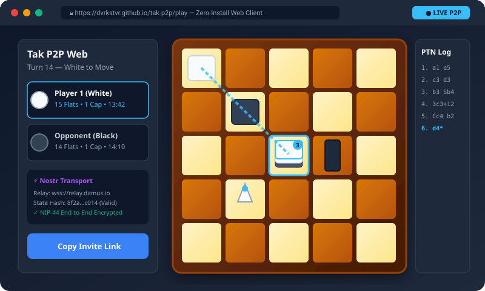
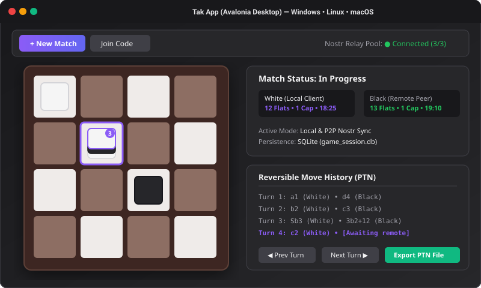
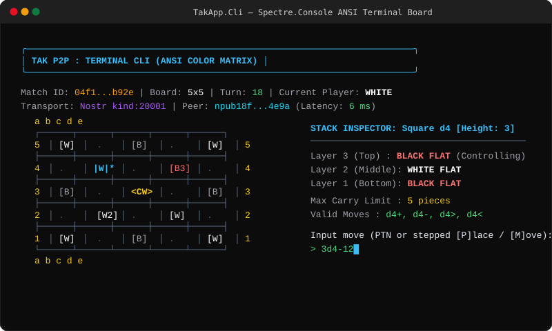
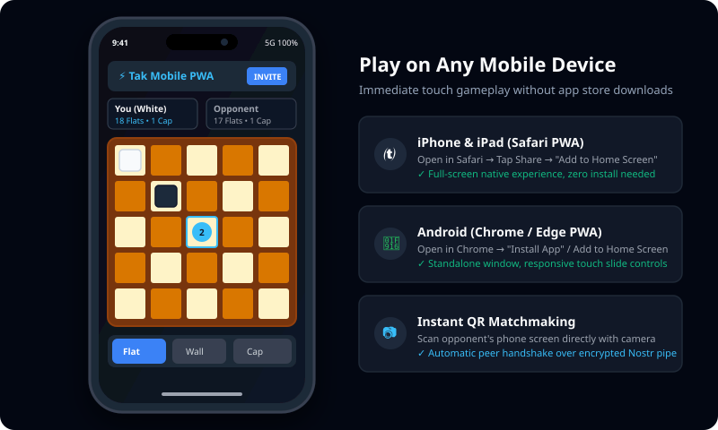

# Tak P2P: Decentralized Peer-to-Peer Tak

> A decentralized, peer-to-peer (P2P), zero-server implementation of the abstract strategy game **Tak**. The goal is live and asynchronous play between devices over public Nostr relays, across web browsers, Windows, Linux, macOS, Android, and iOS.

> **Project status:** the rules engine is built and unit-tested. Online play between two devices does **not** work yet; every client currently plays local games only. Current status lives in [pipeline/STATUS.md](pipeline/STATUS.md) and [pipeline/features.json](pipeline/features.json).

[](https://dvrkstvr.github.io/tak-p2p/)
[](https://github.com/Dvrkstvr/tak-p2p/releases)
[](https://dotnet.microsoft.com/)
[](LICENSE)
[](src/)

---

## 🎮 Try It in Your Browser (Zero Install)

The web client runs in your browser without installing anything:

### 🚀 **[👉 Launch the Web Client 👈](https://dvrkstvr.github.io/tak-p2p/)**
**URL:** [https://dvrkstvr.github.io/tak-p2p/](https://dvrkstvr.github.io/tak-p2p/)

* **Local play:** pass-and-play on one device, or play against the built-in AI. In-browser play has not been verified end to end yet.
* **No accounts:** an identity keypair is generated and stored locally in your browser. It is currently Ed25519 and will become a secp256k1 Nostr key.
* **Invites (not working yet):** the client can create an invite link (`/?invite=TAK1_...`) or QR code, but opening one starts a local game rather than connecting to the other player.
* **Responsive UI:** touch and mouse controls with vector SVG rendering.

---

## 📦 Releases & Downloads

Pre-built packages are published on [GitHub Releases](https://github.com/Dvrkstvr/tak-p2p/releases). The release workflow builds them, but they have not yet been verified by launching them on each platform:

| Package / Artifact | Platform | Format | Description | Quick Download |
| :--- | :--- | :--- | :--- | :--- |
| **Windows Desktop** | Windows 10 / 11 (x64) | `.zip` | Standalone GUI app (`TakApp.Avalonia.Desktop`) with hardware acceleration | [Download Windows App](https://github.com/Dvrkstvr/tak-p2p/releases/latest/download/tak-desktop-windows-x64.zip) |
| **Windows CLI** | Windows 10 / 11 (x64) | `.zip` | Terminal client (`TakApp.Cli`) with rich Spectre.Console ANSI interface | [Download Windows CLI](https://github.com/Dvrkstvr/tak-p2p/releases/latest/download/tak-cli-windows-x64.zip) |
| **Linux Desktop** | Ubuntu, Debian, Fedora, Arch, SteamOS | `.tar.gz` | Standalone Linux GUI app (X11 & Wayland native) | [Download Linux App](https://github.com/Dvrkstvr/tak-p2p/releases/latest/download/tak-desktop-linux-x64.tar.gz) |
| **Linux CLI** | Linux (x64) | `.tar.gz` | Terminal client for all POSIX terminal emulators | [Download Linux CLI](https://github.com/Dvrkstvr/tak-p2p/releases/latest/download/tak-cli-linux-x64.tar.gz) |
| **Android Native App** | Android Phones & Tablets (API 23+) | `.apk` | Native Android application (`TakApp.Avalonia.Android`) | [Download APK](https://github.com/Dvrkstvr/tak-p2p/releases/latest/download/tak-android.apk) (never run on a device) |
| **iOS & iPadOS Native App** | iPad & iPhone (iOS 13+) | Source only | Avalonia iOS project (`TakApp.Avalonia.iOS`); not built or released | Use the [Web Client](https://dvrkstvr.github.io/tak-p2p/) in Safari |
| **Web Client** | All Browsers (Desktop & Mobile) | WebAssembly | Zero-install play in the browser (not installable as a PWA yet) | [Launch Web Client](https://dvrkstvr.github.io/tak-p2p/) |

> *All release archives include corresponding `.sha256` checksum files for cryptographic verification.*

---

## 📱 Supported Devices & Methods of Play

Tak P2P is engineered with a strict **Separation of Concerns**—the deterministic core engine (`TakEngine.Core`) and peer-to-peer wire protocol (`TakEngine.Transport`) are decoupled from the user interface, enabling native performance across all major operating systems and web platforms.

### Overview Matrix

| Device / Platform | Method of Play | Technology | Implementation Status | Quick Launch / Access |
| :--- | :--- | :--- | :--- | :--- |
| **🌐 Web Browser** | Zero-Install Web Client | Blazor WebAssembly (.NET 10) | 🟡 **Deployed, not verified** (site deploys; in-browser play not yet verified; no PWA/offline) | [Launch Web Client](https://dvrkstvr.github.io/tak-p2p/) |
| **🪟 Windows PC** | Native Desktop App & Terminal CLI | Avalonia UI + Spectre.Console | 🟡 **Released, not verified** (archives published; desktop and CLI not yet verified running) | [GitHub Releases](https://github.com/Dvrkstvr/tak-p2p/releases) (`tak-desktop-windows-x64.zip`) |
| **🐧 Linux** | Native Desktop App & Terminal CLI | Avalonia UI (X11/Wayland) + CLI | 🟡 **Released, not verified** (archives published; desktop and CLI not yet verified running) | [GitHub Releases](https://github.com/Dvrkstvr/tak-p2p/releases) (`tak-desktop-linux-x64.tar.gz`) |
| **💻 MacBook / macOS** | Native Desktop App & Terminal CLI | Avalonia Desktop + Terminal CLI | 🔴 **Not released** (no macOS build published; never run on macOS) | Build from source, or use the [Web Client](https://dvrkstvr.github.io/tak-p2p/) |
| **🤖 Android** | Mobile Browser & Native App | Blazor WASM in browser + Native APK (`TakApp.Avalonia.Android`) | 🟡 **APK published, not verified** (never run on a device) | [Download APK](https://github.com/Dvrkstvr/tak-p2p/releases/latest/download/tak-android.apk) • [Web Client](https://dvrkstvr.github.io/tak-p2p/) |
| **📱 iPhone & iPad** | Mobile Browser & Native App | Blazor WASM in Safari + Native iOS App | 🔴 **Native app not built** (never built or run on a device) | [Web Client in Safari](https://dvrkstvr.github.io/tak-p2p/) |

> Status mirrors [pipeline/features.json](pipeline/features.json): 🟢 verified with evidence · 🟡 built or published, not yet verified · 🔴 not available. No platform is 🟢 yet.
> **Online play between two devices over Nostr relays does not work on any platform yet** (F-014 to F-017): joining an invite currently starts a local game.

---

### Detailed Device Breakdown: What Exists vs. What is Missing

"Built" means the code exists and compiles; it has not yet been verified in a running app (see [pipeline/features.json](pipeline/features.json)). On every platform, **online play between two devices is missing**. Moves are never sent over relays, joining an invite starts a local game, and encryption between peers is not yet real NIP-44.

#### 1. 🌐 Web Client (Desktop & Mobile Browsers)
* **Method of Play:** Web application running client-side in the browser via WebAssembly (Blazor WASM).
* **Target Devices:** Any modern web browser on Windows, macOS, Linux, iOS, and Android.
* **✅ Verified:**
  * Automated deployment to GitHub Pages on every push to `main`.
* **🔧 Built (not yet verified in a browser):**
  * Interactive vector SVG board for 4x4, 5x5, and 6x6 games, with 3D isometric stacks, standing walls, and capstones.
  * Local pass-and-play and play against the AI, with PlayTak-style controls.
  * Move history panel for reviewing earlier moves.
  * Invite link and QR code generation.
  * Profile publishing to public Nostr relays (`wss://relay.damus.io`, `wss://nos.lol`, `wss://relay.primal.net`). Events are not yet signed, so relays are expected to reject them.
* **⏳ Missing / Next:**
  * Online games: sending and receiving moves over relays, and joining an invite.
  * Moving the browser onto the shared engine session (`TakGameSession`), so browser games get hash-chain and signature checks.
  * Saving games so they resume after the tab is closed.
  * Progressive Web App (PWA) install and offline cache.

#### 2. 🪟 Windows App
* **Method of Play:** Native desktop GUI (`TakApp.Avalonia`) and command-line interface (`TakApp.Cli`).
* **Target Devices:** Windows 10 and Windows 11 (x64).
* **🔧 Built (release archives published, not yet verified running):**
  * Avalonia MVVM desktop application with board view, reserves, and PTN history. Its "remote" mode simulates both players in one process.
  * Spectre.Console terminal client (`TakApp.Cli`) with local play and play against the AI.
  * SQLite game storage with instant restore to any turn, used by the CLI.
  * SHA-256 state hash chain and Ed25519 move signatures (engine level, unit-tested).
* **⏳ Missing / Next:**
  * Online games over relays (see above).
  * MSIX / installer package, turn notifications, and an auto-updater.

#### 3. 🐧 Linux App
* **Method of Play:** Native desktop GUI (`TakApp.Avalonia`) and terminal CLI (`TakApp.Cli`).
* **Target Devices:** x64 Linux distributions (X11 & Wayland).
* **🔧 Built (release archives published, not yet verified running):**
  * The same Avalonia desktop UI and terminal CLI as Windows, with SQLite storage in the CLI.
* **⏳ Missing / Next:**
  * Online games over relays (see above).
  * Flatpak, AppImage, or Snap packages, and desktop notifications.

#### 4. 💻 MacBook / macOS App
* **Method of Play:** Native desktop GUI (`TakApp.Avalonia`) and Terminal CLI (`TakApp.Cli`).
* **Target Devices:** Apple Silicon and Intel Macs.
* **🔧 Built:**
  * The Avalonia desktop app and CLI target the cross-platform .NET 10 runtime. No macOS build is published and neither has been run on macOS.
* **⏳ Missing / Next:**
  * A macOS release build, a `.app` bundle or `.dmg`, codesigning and notarization.
  * Online games over relays (see above).

#### 5. 🤖 Android App
* **Method of Play:** Native Android app (`TakApp.Avalonia.Android`), or the web client in a mobile browser.
* **Distribution Status:** An APK is attached to GitHub Releases. It has never been installed and run on a device.
* **Target Devices:** Android phones and tablets running Android 6.0+ (API 23+).
* **🔧 Built (not yet verified on a device):**
  * Native project head (`TakApp.Avalonia.Android`) using Avalonia UI, built with `dotnet build src/TakApp.Avalonia.Android/TakApp.Avalonia.Android.csproj`.
  * App icon and splash resources; `INTERNET` and `ACCESS_NETWORK_STATE` permissions in `AndroidManifest.xml`.
* **⏳ Missing / Next:**
  * A verified run on a real device.
  * Online games over relays (see above).
  * Google Play package (`.aab`), turn notifications, haptics.

#### 6. 📱 iPhone & iPad App
* **Method of Play:** Native iOS/iPadOS app (`TakApp.Avalonia.iOS`), or the web client in Safari.
* **Distribution Status:** Not built or released. Building requires macOS with Xcode and Apple signing.
* **Target Devices:** iPad and iPhone running iOS / iPadOS 13.0+.
* **🔧 Source only:**
  * Native project head (`TakApp.Avalonia.iOS`) configured for iPad and iPhone (`UIDeviceFamily = 1, 2`) with a single-view lifecycle.
* **⏳ Missing / Next:**
  * A first build and run on a simulator or device, codesigning, and TestFlight / App Store distribution.
  * Online games over relays (see above).

---

## 🖼️ Interface Mockups

These are hand-drawn SVG illustrations of the intended design, not screenshots of the running apps. Some features they show (online matchmaking, drag-and-drop, camera QR exchange) are not implemented.

### 1. 🌐 Web Client (Blazor WebAssembly)
> Mockup: browser client with SVG board and turn history.


### 2. 🪟 🐧 💻 Desktop Client (Avalonia UI)
> Mockup: desktop application for Windows, Linux, and macOS with game setup and move inspection.


### 3. 📟 Terminal CLI (Spectre.Console)
> Mockup: ANSI terminal client with interactive menus, stack inspector, and stepped input.


### 4. 📱 Mobile Layout (iPhone & Android)
> Mockup: responsive mobile layout.


---

## 🏛️ System Overview & Core Philosophy

### Architectural Invariants

* **Zero Authoritative Game Servers:** The network layer functions strictly as an encrypted "dumb pipe" / store-and-forward mailbox over Nostr relays. Clients never trust remote states; all moves and state transitions are verified deterministically on the local device.
* **Separation of Concerns:**
  * `TakEngine.Abstractions`: Shared contracts, immutable records, data structures (publicly distributed).
  * `TakEngine.Core`: Private game logic, DFS graph road traversal, cryptographic hashing, invariant checks, state storage.
  * `TakEngine.Transport`: Nostr WebSocket relay interface, encryption (target: NIP-44 v2 with secp256k1 ECDH; not yet compliant), envelope serialization.
  * Frontends (`TakApp.Avalonia`, `TakApp.Cli`, `TakApp.Blazor`): Pure UI views consuming reactive observables/events.
* **Deterministic Rule Adjudication:** Illegal moves are mathematically impossible to force onto a peer. If an opponent injects an invalid payload, the receiving client drops the payload and flags the peer. (Enforced by `TakGameSession`; the web client does not use it yet.)
* **Cryptographic State Hashing:** Every move entity strictly maintains a verifiable hash chain:
  $$\text{StateHash} = \text{SHA-256}(\text{PrevStateHash} \,\|\, \text{TurnIndex} \,\|\, \text{PlayerPubKey} \,\|\, \text{PtnMove} \,\|\, \text{TpsSnapshot})$$

---

## 📂 Repository & Solution Layout

```
TakGame.sln / TakGame.slnx
├── src/
│   ├── TakEngine.Abstractions/       # [Shared NuGet candidate]
│   │   ├── Enums/                    # PieceType, PlayerColor, Direction, GamePhase
│   │   ├── Models/                   # Coord, StackSnapshot, BoardSnapshot, TakMove, BroadcastModels
│   │   ├── ITakGameSession.cs        # Primary interface consumed by all frontends
│   │   └── ISpectatorGameSession.cs  # Spectator/broadcast observable interface
│   │
│   ├── TakEngine.Core/               # [Engine & Rules Core]
│   │   ├── Board/                    # Grid, Stacks, Piece Inventories, Move Execution
│   │   ├── Rules/                    # Invariant rules, Carry limits, DFS Road finder, MoveValidator
│   │   ├── Serialization/            # PTN (Portable Tak Notation) & TPS (Tak Positional System)
│   │   ├── Cryptography/             # Keypairs, Signatures, SHA-256 State Hashing
│   │   ├── Storage/                  # SQLite database engine, Match logs, Replay provider
│   │   ├── Session/                  # TakGameSession, DelayedBroadcastQueue, SpectatorSession, NTP
│   │   ├── AI/                       # Minimax bot
│   │   └── Rendering/                # SVG tile renderer
│   │
│   ├── TakEngine.Transport/          # [Nostr P2P Infrastructure - not yet wired into any frontend]
│   │   ├── Nostr/                    # WebSocket relay client, NIP-01 messages, encryption (not yet NIP-44 compliant)
│   │   ├── Matchmaking/              # Invite codes, Quick Play message builder
│   │   └── TransportEnvelope.cs      # Signed wire models
│   │
│   ├── TakApp.Blazor/                # [Runnable Zero-Install Web Client]
│   │   ├── Components/               # Board (TakBoardView, PieceStackSvg, StackSlideBar), Modals, Panels
│   │   ├── Pages/                    # Home.razor, Play.razor
│   │   └── wwwroot/                  # Static assets & GitHub Pages deployment
│   │
│   ├── TakApp.Avalonia/              # [Shared Cross-Platform UI & MVVM Library]
│   │   ├── ViewModels/               # MVVM ViewModels (CommunityToolkit.Mvvm)
│   │   └── Views/                    # Board, reserves, move history, game controls, new-game views
│   │
│   ├── TakApp.Avalonia.Desktop/      # [Runnable Desktop GUI - Windows, macOS, Linux]
│   │   ├── Program.cs                # Desktop entry point
│   │   └── app.manifest              # Windows DPI awareness & OS compatibility
│   │
│   ├── TakApp.Avalonia.Android/      # [Android app head - never run on a device]
│   │   ├── MainActivity.cs           # Android entry point & activity lifecycle
│   │   ├── Application.cs            # Android application bootstrap
│   │   └── Properties/               # AndroidManifest.xml
│   │
│   ├── TakApp.Avalonia.iOS/          # [iOS & iPadOS app head - not yet built]
│   │   ├── Main.cs                   # iOS entry point
│   │   ├── AppDelegate.cs            # iOS application delegate
│   │   └── Info.plist                # iPad & iPhone device family configuration
│   │
│   └── TakApp.Cli/                   # [Runnable Console App]
│       ├── Program.cs                # Entry point, Interactive menus
│       ├── Rendering/                # Spectre.Console ANSI board, stack layer inspector
│       └── Input/                    # Conversational stepped typed input & PTN command parser
│
└── tests/
    ├── TakEngine.Core.Tests/         # Rule engine unit tests, DFS validation, PTN parser, Crypto, SQLite, Spectator tests
    └── TakEngine.Transport.Tests/    # Relay message serialization, invite codes, encryption (single-peer round trip only)
```

---

## 🛠️ Local Build & Execution Guide

### Prerequisites
* [.NET 10 SDK](https://dotnet.microsoft.com/download/dotnet/10.0)

### 1. Run All Tests
```powershell
dotnet test TakGame.sln
```
*(Runs every test project in the solution: engine core and transport.)*

### 2. Run the Web Client Locally
```powershell
dotnet run --project src/TakApp.Blazor/TakApp.Blazor.csproj
```
Open `http://localhost:5000` in your web browser.

### 3. Run the Desktop Client (Windows / Linux / macOS)
```powershell
dotnet run --project src/TakApp.Avalonia.Desktop/TakApp.Avalonia.Desktop.csproj
```

### 4. Build Android APK / App Bundle (Phone & Tablet)
```powershell
dotnet build src/TakApp.Avalonia.Android/TakApp.Avalonia.Android.csproj
```

### 5. Build iOS & iPadOS App
```powershell
dotnet build src/TakApp.Avalonia.iOS/TakApp.Avalonia.iOS.csproj
```

### 6. Run the Terminal CLI
```powershell
dotnet run --project src/TakApp.Cli/TakApp.Cli.csproj
```

### 7. Publish Standalone Single-File Desktop Binaries
To produce a portable standalone executable for Windows:
```powershell
dotnet publish src/TakApp.Avalonia.Desktop/TakApp.Avalonia.Desktop.csproj -c Release -r win-x64 --self-contained true -p:PublishSingleFile=true -p:DebugType=None -o ./dist/windows
```
Or download automated pre-packaged builds directly from [GitHub Releases](https://github.com/Dvrkstvr/tak-p2p/releases).

---

## 📖 Documentation Index

**Current status** lives in [pipeline/STATUS.md](pipeline/STATUS.md) and [pipeline/features.json](pipeline/features.json). The milestone status tables in the specifications below are historical, and some of them overstate what works.

1. [Full Specification & Handoff Document](docs/PROJECT_SPECIFICATION.md) - Complete consolidated master specification.
2. [System Overview](docs/system-overview.md) - High-level architecture, principles, and invariants.
3. [Version 1.0 (MVP) Specification](docs/v1-mvp.md) - Deliverables, layout, Nostr transport, SQLite schema, `ITakGameSession` API, and milestones.
4. [Version 2.0 (Competitive & Tournaments) Specification](docs/v2-tournaments.md) - Co-signed receipts, Swiss tournaments, Elo oracle, anti-cheat, spectator broadcasting, and v2 database schema.
5. [Wire Protocol Specification](docs/wire-protocol.md) - Nostr envelopes, NIP-44 encryption, matchmaking, and spectator broadcast events.
6. [Database Schema Specification](docs/database-schema.md) - Complete SQLite schema for v1 and v2 migrations.
7. [Blazor WebAssembly & GitHub Pages Specification](docs/blazor-web-github-pages.md) - Design and zero-cost deployment architecture for the browser client.
8. [Spectator & Broadcast Implementation Plan](docs/spectator-implementation-plan.md) - Real-time observation, delayed public streams, and feature match directory.
9. [Development Log (DevLog)](docs/DEVLOG.md) - Historical commit and milestone log up to M1.15.3; no longer updated (git log is the history).
10. [Comprehensive MVP Project Audit](docs/AUDIT.md) - Code quality, architecture assessment, test verification, and prioritized roadmap.
