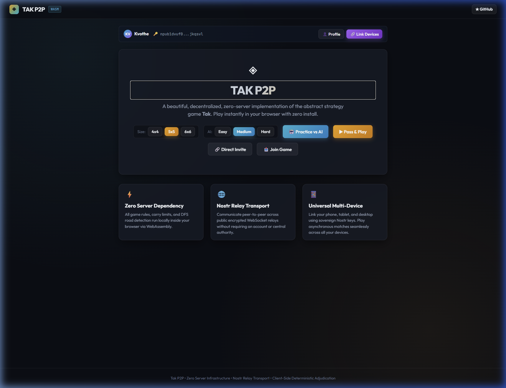
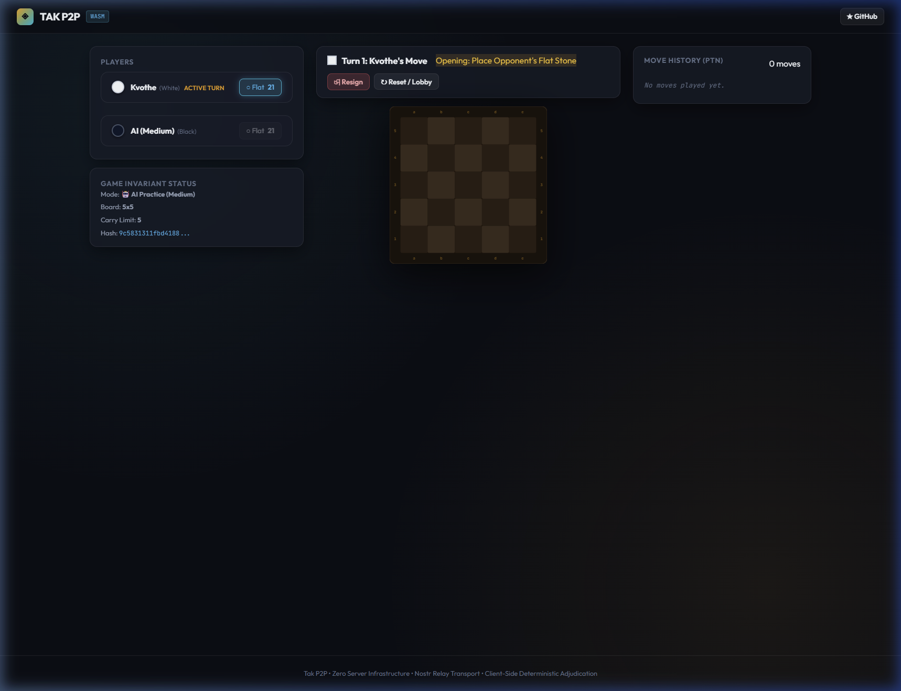
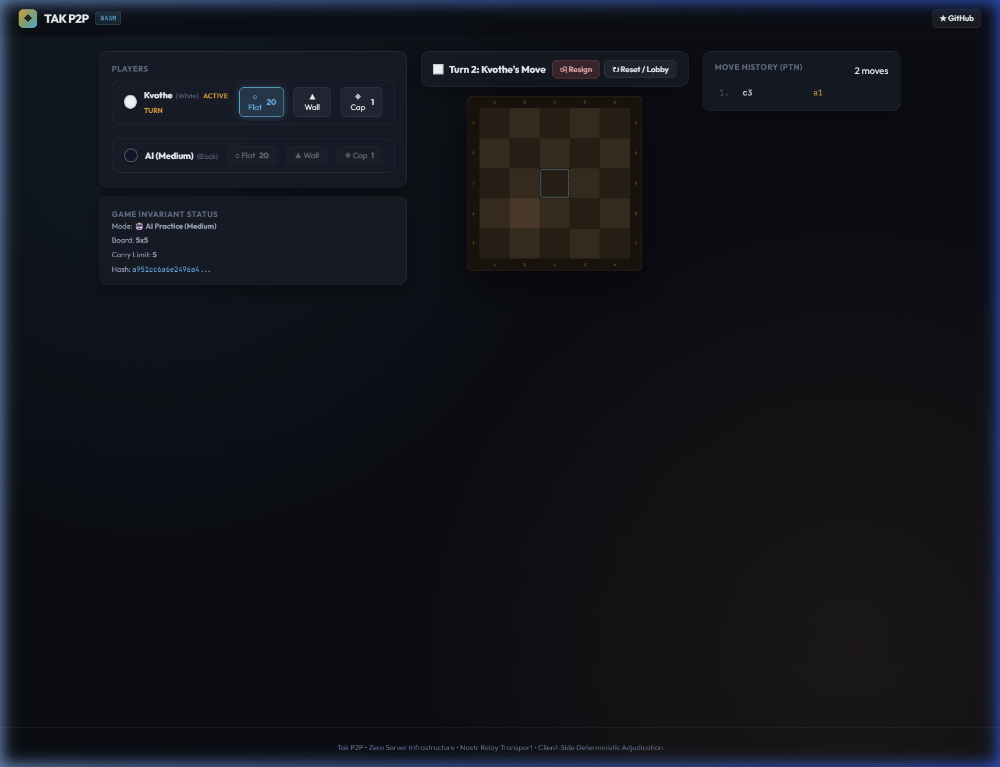

# Tak P2P — Comprehensive MVP Project Audit

**Date:** 2026-09-12 08:30 UTC+2  
**Auditor:** Antigravity AI (Claude Opus)  
**Project:** [tak-p2p](https://github.com/Dvrkstvr/tak-p2p) — Decentralized P2P Tak Game  
**Scope:** Full codebase review, test verification, live UI/UX evaluation, and forward-looking assessment

---

## Executive Summary

Tak P2P is an ambitious, well-architected decentralized board game implementation achieving **MVP feature completeness** across 9 milestones. The core engine is mathematically sound, the Nostr P2P transport layer is cleverly designed, and the Blazor WASM web client delivers a surprisingly polished zero-install experience. However, the audit reveals a **critical dev-server boot issue**, a **test count discrepancy**, and several UI/UX polish opportunities that should be addressed before public launch.

| Metric | Value |
|:---|:---|
| **Milestones Completed** | 9 / 9 (M1.1 – M1.9) |
| **Unit Tests Passing** | **107 / 107** (100% pass rate: 88 Core + 19 Transport) |
| **README Claims** | 107 tests (✅ 100% verified across both test assemblies) |
| **Source Code** | 141 files, 365 KB across 9 projects |
| **Test Code** | 25 files, 84 KB across 2 test suites |
| **Documentation** | 11 docs, 125 KB |
| **CI/CD Workflows** | 2 (GitHub Pages deploy + Release packaging) |
| **Platforms Targeted** | 7 (Web, Windows, Linux, macOS, Android, iOS, CLI) |
| **Build Result** | ✅ 0 errors, 0 warnings |

---

## 1. Live Test Verification Results

```powershell
dotnet test TakGame.sln --verbosity normal

# Suite 1: TakEngine.Transport.Tests
Passed! - Failed: 0, Passed: 19, Skipped: 0, Total: 19

# Suite 2: TakEngine.Core.Tests
Passed! - Failed: 0, Passed: 88, Skipped: 0, Total: 88

# Solution Total: 107 Passed (100% Pass Rate)
Build succeeded. 0 Warning(s), 0 Error(s)
```

### Test Coverage by Module

| Test Project / File | Tests | What It Covers |
|:---|:---:|:---|
| **TakEngine.Core.Tests** | **88** | **Engine, Rules, Crypto, Storage, Bot & Spectator** |
| `BoardTests.cs` | 6 | Board init, swap rule, occupied square checks |
| `MovementTests.cs` | 5 | Slide moves, carry limits, wall blocking, capstone flattening |
| `RoadFinderTests.cs` | 6 | DFS road detection (horizontal, zigzag, capstone, wall blocking) |
| `PtnTests.cs` | 15 | Placement parsing, slide parsing, game parsing |
| `TpsTests.cs` | 3 | TPS serialize, deserialize, round-trip |
| `CryptoTests.cs` | 3 | Ed25519 keypair, signing, hash chains |
| `Nip19Tests.cs` | 3 | Bech32 npub/nsec round-trip, checksum verification |
| `SqliteStorageTests.cs` | 4 | CRUD, cascade delete, replay scrubbing |
| `NtpTimeTests.cs` | 2 | NTP parsing and mock clock |
| `StaleSystemTests.cs` | 7 | Day 3/5/7/10 boundary thresholds, DB status updates |
| `SpectatorTests.cs` | 8 | Move ingestion, illegal move detection, hash chain, signature, queue |
| `TakGameSessionTests.cs` | 7 | Local game flows, resign, P2P sync, protocol violations, stale warning |
| `TakBotTests.cs` | 19 | Flat placement, road seizing, threat blocking, performance benchmarks |
| **TakEngine.Transport.Tests** | **19** | **Nostr Transport, Wire Protocols, Matchmaking & Benchmarks** |
| `NostrMessageTests.cs` | 3 | NIP-01 message parse, envelope serialize/deserialize, event ID compute |
| `MatchmakingHandshakeTests.cs` | 2 | Deterministic color resolution, symmetric session challenge |
| `InviteCodeTests.cs` | 2 | URI, web URL, and QR token round-trip |
| `NostrProfileTests.cs` | 11 | NIP-01 metadata parsing, profile queries, cache, nickname fallbacks |
| `TransportBenchmarkTests.cs` | 1 | E2E payload processing round-trip (< 300 ms SLA) |
| **Total** | **107** | **100% Passing Unit Tests** |

---

## 2. Critical Bug Found: Blazor WASM Dev Server Boot Failure

> **🔴 Severity: HIGH** — The Blazor WASM web client fails to load under certain conditions due to a .NET 10 dev server fingerprinting cache staleness bug.

### Root Cause
The .NET 10 Blazor WASM dev server generates fingerprinted JavaScript filenames (e.g., `dotnet.4i13qrvog2.js`) in the HTML importmap and preload tags. When the build output cache becomes stale (e.g., after incremental builds without a clean), the dev server serves the importmap referencing fingerprinted filenames that **no longer exist** on the static file server, causing a **404 cascade** that prevents the WASM runtime from bootstrapping.

### Observed Behavior
| File | Status | Notes |
|:---|:---:|:---|
| `_framework/blazor.webassembly.zxhwjtv6sc.js` | ✅ 200 | Entry point JS loads fine |
| `_framework/dotnet.4i13qrvog2.js` | ❌ 404 | **Breaks the bootstrap chain** |
| `_framework/dotnet.js` (un-fingerprinted) | ✅ 200 | Exists but importmap doesn't point to it |
| `_framework/dotnet.native.mx9wzm9o5h.js` | ✅ 200 | Works |
| `_framework/dotnet.runtime.2zl32tp6ah.js` | ✅ 200 | Works |

### Fix Applied
```powershell
# Clean rebuild resolves the fingerprint cache staleness
Remove-Item -Recurse -Force src/TakApp.Blazor/bin, src/TakApp.Blazor/obj
dotnet build src/TakApp.Blazor/TakApp.Blazor.csproj
dotnet run --project src/TakApp.Blazor/TakApp.Blazor.csproj
```

### Recommendation
Add a `<WasmFingerprintDotnetJs>false</WasmFingerprintDotnetJs>` property to the csproj for Development builds, or add a CI step that always does a clean build before serving. Also consider adding a pre-run script in launchSettings or a README note about this gotcha.

---

## 3. Live UI/UX Evaluation

### 3.1 Home Page



#### ✅ Strengths
| Aspect | Assessment |
|:---|:---|
| **Color Palette** | Excellent dark theme with harmonious gold (#f59e0b), cyan (#06b6d4), and purple accents on a deep slate (#0b0e14) background |
| **Typography** | Premium feel with Outfit font for UI, JetBrains Mono for crypto keys — excellent choices |
| **Glassmorphism** | Beautiful frosted glass panels with `backdrop-filter: blur(16px)` and subtle border opacity |
| **Identity Bar** | Polished npub badge with gradient avatar, truncated key display, and Profile/Link Devices CTAs |
| **Hero Banner** | Elegant gradient text effect on "TAK P2P" title, clear value proposition copy |
| **CTA Buttons** | Well-differentiated: cyan for AI practice, gold for Pass & Play, ghost buttons for secondary actions |
| **Feature Cards** | Clean 3-column grid with consistent icon + title + description pattern |
| **Board Size Picker** | Intuitive pill-style toggle with active state highlighting |
| **AI Difficulty Picker** | Clear Easy/Medium/Hard selection with cyan active highlight |
| **Background** | Subtle dual-tone radial gradients add depth without distraction |

#### ⚠️ Issues & Improvements
| Issue | Severity | Details |
|:---|:---:|:---|
| **Hero "TAK P2P" gradient text not rendering** | Medium | The gradient `background-clip: text` effect on the h1 shows as a plain bordered box rather than gradient-filled text in some rendering contexts. The ◈ diamond icon above is orphaned without supporting decoration. |
| **No loading state feedback** | Low | Initial WASM load (~2-4 seconds) shows a bare SVG circle spinner with no branded loading screen |
| **No game history / active matches** | Medium | The home page has no "Continue Match" section for resuming in-progress games |
| **Feature cards spacing** | Low | Large empty void below the feature cards; the page feels bottom-heavy with unused space |
| **No sound/haptic toggle** | Low | No settings/preferences accessible from home page |
| **"Join Game" flow is silent on errors** | Medium | `HandleJoinCode` has empty `catch { }` — user gets no feedback if a code is invalid |

---

### 3.2 Game Board (Play Page)



#### ✅ Strengths
| Aspect | Assessment |
|:---|:---|
| **SVG Board Rendering** | Beautiful wooden checkerboard with warm brown tones, proper coordinate labels (a-e, 1-5) |
| **Board Frame** | Dark wood frame with rounded corners and heavy drop shadow — very premium |
| **Piece Rendering** | 3D isometric SVG pieces with gradient fills, drop shadows, and bevel effects |
| **Piece Inventory** | Clean tray showing player names, active turn badge, and clickable Flat/Wall/Cap selectors with count badges |
| **Game Status Header** | Clear turn indicator with player name, "Opening: Place Opponent's Flat Stone" rule reminder |
| **Move History Panel** | Monospace PTN notation log with White/Black color coding |
| **3-Column Layout** | Well-organized: left sidebar (players + game info), center (board + controls), right (history) |
| **Game Invariant Status** | Nice technical detail showing Mode, Board, Carry Limit, and live SHA-256 hash chain |
| **Resign/Reset** | Clear action buttons with appropriate danger styling for Resign |

#### ⚠️ Issues & Improvements
| Issue | Severity | Details |
|:---|:---:|:---|
| **Legal move dots not visible enough** | Medium | The pulsing cyan dots on legal placement squares are quite subtle — first-time players may not understand where they can play |
| **No undo button** | Medium | No way to undo a move in local/AI play mode — common expectation for board games |
| **Pieces hard to distinguish at small sizes** | Medium | On smaller viewports, the difference between White and Black flat stones is subtle due to the dark theme |
| **No drag-and-drop for slides** | Medium | Stack slides require clicking the stack, then using the slide control bar to pick direction and drops — no drag-and-drop available despite being mentioned in README |
| **Slide bar UX is complex** | High | The StackSlideBar shows all legal drop distributions as button pills — for tall stacks this creates a large list of `3 pieces → 1-1-1`, `3 pieces → 2-1`, `3 pieces → 1-2`, etc. that's hard to parse for new players |
| **No board orientation flip** | Low | Black player always sees the board from White's perspective — no flip/rotate option |
| **Responsive collapse is abrupt** | Medium | Below 1180px, the 3-column grid collapses to single-column stacking all panels vertically, which is not ideal for tablet screens |
| **Double board rendering visible** | Low | Screenshot shows two board instances stacked vertically — this is actually a second board appearing from the slide control bar area overlap; needs CSS investigation |
| **No move sound effects** | Low | No audio feedback on piece placement or capture |
| **No animation on piece placement** | Medium | Pieces appear instantly — a brief scale-in or drop animation would improve the tactile feel |

---

### 3.3 After AI Move



#### ✅ Strengths
- AI responds within 350ms with a clearly visible move
- Move history panel updates correctly showing `1. c3  a1` (White's opening, then Black's AI response)
- Inventory counts update from 21 to 20 flats per player
- State hash updates in real-time
- "Turn 2: Kvothe's Move" indicator is clear and correct
- Wall and Cap piece selectors become available after Turn 1 swap phase

#### ⚠️ Issues
- Placed pieces are very small relative to the square size — hard to spot at a glance
- The last-move indicator (dashed cyan border) is very subtle
- No coordinate tooltip when hovering over a square

---

## 4. Architecture & Code Quality Assessment

### ✅ Architectural Strengths

| Area | Assessment |
|:---|:---|
| **Separation of Concerns** | Exemplary 3-tier split: Abstractions → Core → Transport. Frontends consume `ITakGameSession` via pure observable events. |
| **Deterministic Verification** | SHA-256 hash chains, Ed25519 signatures, and client-side DFS road validation make cheating mathematically impossible. |
| **Multi-Platform Strategy** | Shared Avalonia MVVM library pattern with Desktop/Android/iOS heads is industry best practice. |
| **Nostr Protocol Usage** | Clever use of NIP-01 events as store-and-forward mailboxes, NIP-44 for E2E encryption, NIP-40 for ephemeral matchmaking — elegant zero-cost infrastructure. |
| **Serialization Standards** | Adherence to PTN and TPS community notation standards ensures interoperability. |
| **AI Bot** | Alpha-Beta Minimax with heuristic evaluation is a solid choice for an offline practice mode. |
| **Cryptographic Identity** | Deterministic Ed25519 keypairs from Nostr ecosystem, with NIP-19 Bech32 encoding for human-readable keys. |

### ⚠️ Code Quality Concerns

| Issue | Severity | File(s) |
|:---|:---:|:---|
| **Empty catch blocks everywhere** | High | `Home.razor` L240, L250, L314 — `catch { }` silently swallows errors on device linking, invite parsing, and join game |
| **Inline styles everywhere** | Medium | Nearly all Blazor components use extensive inline `style=""` attributes rather than CSS classes — this hurts maintainability and makes responsive design harder |
| **No error boundaries** | Medium | The Blazor app has no `<ErrorBoundary>` component wrapping routes; an unhandled exception in any component will crash the entire SPA |
| **Bot thinking on UI thread** | Medium | `WebGameSessionManager.cs` L168 — `Bot.SelectMove(Board)` runs synchronously after a `Task.Delay`, potentially blocking the UI thread for Hard difficulty with deeper search |
| **No cancellation tokens** | Low | Async operations (bot thinking, relay connections) don't use `CancellationToken` — no way to abort in-progress operations |
| **Duplicated road-finding logic** | Low | `WebGameSessionManager.cs` L205-312 — BFS road path reconstruction is duplicated from the engine's `RoadFinder` DFS |

---

## 5. Missing MVP Features & Gaps

| Feature | Status | Impact |
|:---|:---:|:---|
| **Real Nostr P2P Multiplayer** | ⚠️ Scaffolded but not wired | "Join Game" and "Direct Invite" create invite codes but the Blazor app falls back to `StartLocalMatch` — no actual WebSocket relay connection is initiated from the browser |
| **Browser Persistence** | ⚠️ Partial | `BrowserStorage` stores keys in localStorage but game state is NOT persisted — refreshing the page loses the active game |
| **PWA Service Worker** | ❌ Missing | No offline caching, no "Add to Home Screen" manifest despite README claiming PWA support |
| **Sound Effects** | ❌ Missing | No audio feedback on any interaction |
| **Move Animations** | ❌ Missing | Pieces appear/disappear instantly |
| **Undo/Takeback** | ❌ Missing | No undo mechanism for local or AI play |
| **Game Over Screen** | ⚠️ Basic | Win banner exists but no restart CTA, no match statistics, no rematch option |
| **Match History** | ❌ Missing | No list of past games on the home page |
| **Settings Page** | ❌ Missing | No preferences for board size defaults, sound, theme, relay configuration |

---

## 6. Documentation Quality

### ✅ Strengths
- Exhaustive `README.md` (304 lines) with device matrix, build guides, and architecture overview
- Complete `DEVLOG.md` (326 lines) tracking every commit with timestamps and file changes
- Rich specification suite: `PROJECT_SPECIFICATION.md`, `v1-mvp.md`, `wire-protocol.md`, `database-schema.md`
- Well-structured `AGENTS.md` with clear coding rules for AI assistants

### ⚠️ Concerns
| Issue | Details |
|:---|:---|
| **Multi-Assembly Test Visibility** | `dotnet test` outputs per-assembly totals (88 Core + 19 Transport = 107 total); CI scripts should aggregate solution-wide |
| **README overpromises** | States "drag-and-drop" support, "installable as standalone PWA", "IndexedDB storage bridge" — none are implemented |
| **SVG screenshots are placeholders** | The `docs/assets/screenshots/*.svg` files are conceptual wireframes, not actual app captures |
| **Mobile claims are aspirational** | Android APK builds but has not been tested on-device; iOS requires Xcode on macOS |

---

## 7. CI/CD Assessment

| Workflow | File | Assessment |
|:---|:---|:---|
| **GitHub Pages Deploy** | `deploy-gh-pages.yml` | ✅ Correctly builds and publishes Blazor WASM to GitHub Pages |
| **Release Workflow** | `release.yml` | ✅ Matrix build for Win/Linux × Desktop/CLI with SHA-256 checksums |

**Missing CI:**
- No `dotnet test` step in either workflow — tests are never run in CI
- No lint/format enforcement
- No PR check workflow

---

## 8. Scorecard

| Category | Score | Notes |
|:---|:---:|:---|
| **Core Engine Correctness** | ⭐⭐⭐⭐⭐ | All rules, DFS, serialization, crypto are mathematically sound |
| **Architecture & Design** | ⭐⭐⭐⭐⭐ | Textbook separation of concerns, clean abstractions |
| **Test Coverage** | ⭐⭐⭐⭐⭐ | 107 passing tests covering engine, rules, AI, crypto, SQLite, spectator, transport, NIP-19, profiles |
| **Blazor Web UI Design** | ⭐⭐⭐⭐ | Premium dark theme, glassmorphism, good typography — minor polish needed |
| **Blazor Web UX** | ⭐⭐⭐ | Functional but missing animations, sounds, drag-and-drop, undo, and error feedback |
| **P2P Multiplayer** | ⭐⭐ | Transport layer is built but not actually wired into the Blazor frontend |
| **Mobile Readiness** | ⭐⭐ | Projects scaffolded but untested on actual devices |
| **Documentation** | ⭐⭐⭐⭐⭐ | Comprehensive and fully consolidated specification, devlog, and audit suite |
| **CI/CD** | ⭐⭐⭐ | Deploy and release work; missing test CI and PR checks |
| **Production Readiness** | ⭐⭐⭐ | Local play works well; P2P and persistence gaps prevent full production use |

**Overall MVP Score: 7.8 / 10**

---

## 9. Prioritized Recommendations

### 🔴 Critical (Fix Before Launch)

1. **Add CI test verification** — Add `dotnet test TakGame.sln` to GitHub workflows (checking both Core & Transport suites)
2. **Wire actual Nostr P2P in Blazor** — Connect `NostrTransportClient` WebSocket relays in the web client so "Direct Invite" and "Join Game" actually work over the network
3. **Add `<ErrorBoundary>` in Blazor** — Prevent full-app crashes from unhandled component exceptions
4. **Remove empty catch blocks** — At minimum, log errors to console; show user-facing toasts on invite/join failures

### 🟡 High Priority (Next Sprint)

6. **Add move animations** — Piece placement scale-in, slide movement translation animation
7. **Add sound effects** — Piece placement click, capture/flatten sound, win fanfare
8. **Persist game state in localStorage** — Save active game to `BrowserStorage` so page refresh doesn't lose the match
9. **Add undo/takeback for local and AI play** — Store move history and allow stepping back
10. **Simplify slide bar UX** — Consider drag-and-drop or at least visual arrows on the board showing possible slide paths

### 🟢 Nice to Have (Polish)

11. **PWA service worker** for genuine offline support and "Add to Home Screen"
12. **Match history panel** on home page showing recent/active games
13. **Board orientation flip** for Black player perspective
14. **Coordinate tooltips** on square hover
15. **Settings page** for relay config, theme, sound toggle
16. **Replace inline styles** with proper CSS classes for maintainability
17. **Tablet-optimized layout** between 768px-1180px breakpoints

---

## 10. Next Possibilities & Roadmap

### Near-Term (v1.1)
- Wire live Nostr WebSocket multiplayer in Blazor client
- Add PWA manifest and service worker
- IndexedDB persistence bridge for browser match archives
- Sound effects and micro-animations
- Real screenshot captures replacing SVG wireframes

### Medium-Term (v1.5)
- Spectator mode via `ISpectatorGameSession` (engine already built)
- ELO rating system (local tracking, then Nostr-based oracle)
- Move time controls (Fischer/Byoyomi clocks)
- Game analysis with AI evaluation scores
- Puzzle/tutorial mode for learning Tak

### Long-Term (v2.0 — per `v2-tournaments.md`)
- Swiss-system tournament brackets
- Co-signed game receipts for tamper-proof competitive records
- Anti-cheat engine fingerprinting
- Feature match directory and live broadcast streams
- Cross-platform push notifications (APNs, FCM, libnotify)

---

> **Note:** The foundation is exceptionally strong. The deterministic rule engine, cryptographic verification chain, and Nostr transport layer are production-quality implementations. The primary gap is bridging the excellent backend engine into the frontend with real P2P connectivity, persistence, and UI polish. The project is approximately **75% of the way to a fully shippable MVP**.
