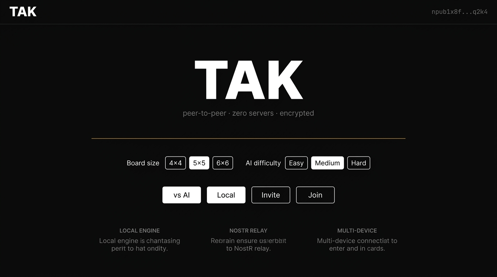
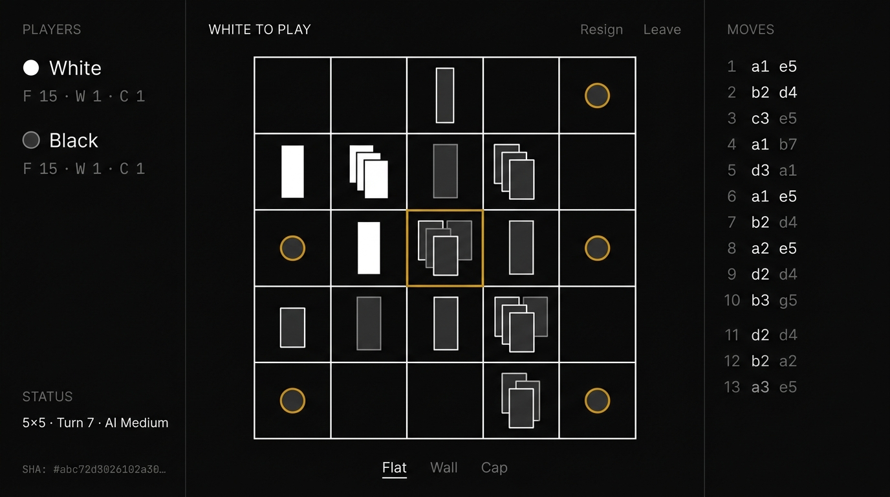
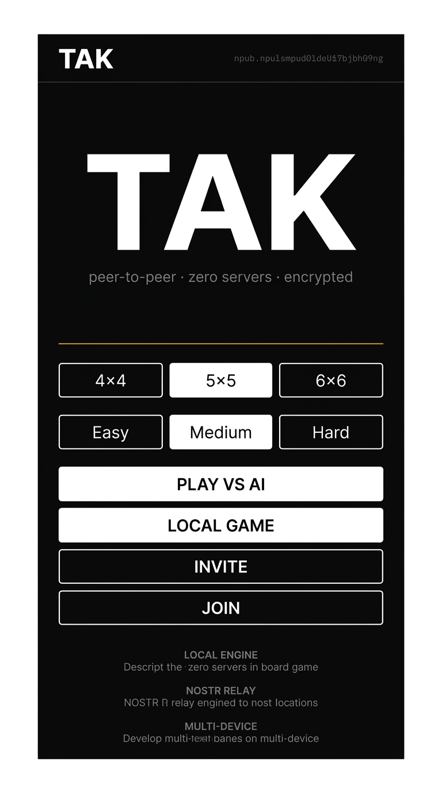
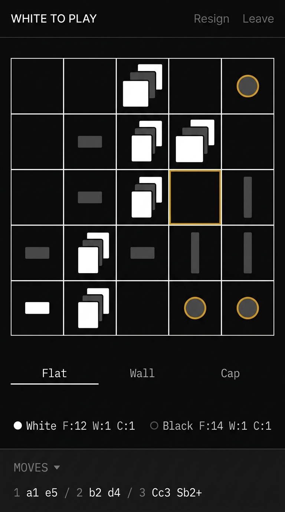

# Tak P2P — UI Mockups & Visual Design Reference

> Minimal, monochromatic redesign for the Tak P2P web client. Black and white with a single amber flair accent. Desktop (1440px) and mobile (390px) viewports across the two primary screens: **Home** and **Play**.

---

## Design Philosophy

**Radical simplicity.** The interface is stripped to its essentials — pure black background, white typography, sharp rectangles, and maximum negative space. The only color in the entire application is a single amber/gold (`#d4a017`) used exclusively for:
- Capstone piece borders
- The selected square highlight
- Section divider lines

Everything else is black, white, or gray.

---

## Design System

| Token | Value | Usage |
| :--- | :--- | :--- |
| **Background** | `#0a0a0a` | Flat black, entire page |
| **Grid Lines** | `#ffffff` at 1px | Board grid, section dividers |
| **Borders (subtle)** | `#1a1a1a` | Header rule, column separators |
| **Amber Accent** | `#d4a017` | Capstones, selected square, decorative dividers |
| **Text Primary** | `#ffffff` | Headings, active content, white player moves |
| **Text Secondary** | `#888888` | Labels, descriptions, black player moves |
| **Text Muted** | `#555555` | Metadata, SHA hashes, section headers |
| **White Pieces** | `#ffffff` fill | Flat stones, walls |
| **Black Pieces** | `#333333` fill, `#ffffff` 1px border | Flat stones, walls |
| **Font Primary** | `Inter` | All UI text |
| **Font Mono** | `JetBrains Mono` | Hashes, PTN notation, npub keys |
| **Border Radius** | `0px` | Sharp rectangles everywhere — no rounding |

### Visual Principles

- **No glassmorphism** — no `backdrop-filter`, no transparency, no blur
- **No gradients** — flat solid fills only
- **No shadows** — zero `box-shadow` anywhere
- **No rounded corners** — all elements are sharp rectangles
- **No icons or emojis** — text labels only
- **Maximum negative space** — the black background is the design

---

## Key Innovation: Staggered Piece Stacks

The board uses a **staggered/cascading** visualization for piece towers. When multiple pieces occupy one square, each piece is offset slightly to the upper-right (like a fanned hand of cards), so the **entire stack composition is visible at a glance** without needing hover/click inspection.

```
Single piece:        Stack of 3:          Stack with wall:
┌─────────┐         ┌─────────┐          ┌─────────┐
│         │         │    ┌──┐ │          │    ┌─┐  │
│  ┌──┐   │         │  ┌─┤W │ │          │  ┌─┤ │  │
│  │W │   │         │┌─┤B ├──┘│          │┌─┤B│ │  │
│  └──┘   │         ││W├──┘  │          ││W├──┘ │  │
│         │         │└──┘    │          │└──┘    │
└─────────┘         └─────────┘          └─────────┘
```

| Piece Type | Representation |
| :--- | :--- |
| **White flat** | White filled rectangle |
| **Black flat** | Dark gray filled rectangle with 1px white border |
| **Standing wall** | Tall narrow rectangle (same fill rules) |
| **Capstone** | Small circle with amber `#d4a017` border |

---

## 1. Desktop — Home (1440px)



### Layout

| Region | Description |
| :--- | :--- |
| **Header** | "TAK" bold white left, truncated `npub` monospace gray right. 1px dark border below |
| **Hero** | Massive "TAK" heading in bold white, wide tracking. Subtitle: "peer-to-peer · zero servers · encrypted" in gray |
| **Divider** | Thin amber `#d4a017` horizontal line |
| **Controls** | Board size: outlined toggle buttons (4×4, **5×5**, 6×6). AI difficulty: outlined toggles (Easy, **Medium**, Hard). Active = white fill / black text, inactive = outlined |
| **Actions** | "vs AI" and "Local" — white fill buttons. "Invite" and "Join" — outlined buttons. All sharp rectangles |
| **Features** | Three text blocks, no cards: "LOCAL ENGINE", "NOSTR RELAY", "MULTI-DEVICE" — uppercase gray labels with gray descriptions |

---

## 2. Desktop — Play (1440px)



### Layout

| Region | Description |
| :--- | :--- |
| **3-Column Grid** | Separated by thin 1px dark gray vertical lines |
| **Left — Players** | "PLAYERS" uppercase muted header. White: ● name + `F 15 · W 1 · C 1` monospace. Black: ○ name + counts. "STATUS" section: `5×5 · Turn 7 · AI Medium`. Truncated SHA hash in tiny monospace |
| **Center — Board** | "WHITE TO PLAY" uppercase + "Resign" / "Leave" in dim gray. 5×5 grid drawn with thin white lines on black — no fills, no textures. Staggered piece stacks showing full tower composition. Selected square highlighted with amber border. Below: "Flat" (underlined active), "Wall", "Cap" text selector |
| **Right — Moves** | "MOVES" uppercase muted header. PTN log in monospace: turn number (gray), white move (white), black move (gray). No row backgrounds |

---

## 3. Mobile — Home (390px)



### Layout

| Region | Description |
| :--- | :--- |
| **Header** | "TAK" bold white left, truncated npub right |
| **Hero** | Large "TAK" centered, subtitle centered below |
| **Divider** | Amber horizontal line |
| **Board Size** | Three full-width toggle buttons in a row |
| **AI Difficulty** | Three full-width toggles in a row |
| **Actions** | Stacked full-width buttons: "PLAY VS AI" (filled), "LOCAL GAME" (filled), "INVITE" (outlined), "JOIN" (outlined). All ≥48px height for touch |
| **Features** | Stacked text blocks centered: labels + descriptions |

---

## 4. Mobile — Play (390px)



### Layout

| Region | Description |
| :--- | :--- |
| **Status Bar** | "WHITE TO PLAY" left, "Resign" / "Leave" right in gray |
| **Board** | Full-width 5×5 grid, thin white lines on black. Staggered piece towers — every piece visible at a glance. Selected square with amber border. Capstones with amber circle borders |
| **Piece Selector** | "Flat" (underlined active), "Wall", "Cap" — full-width row |
| **Inventory** | Single line: `● White F:12 W:1 C:1  ○ Black F:14 W:1 C:1` monospace |
| **Move History** | Collapsible "MOVES ▾" — compact PTN log: `1 a1 e5 / 2 b2 d4 / 3 Cc3 Sb2+` |

---

## File Manifest

| File | Viewport | Description |
| :--- | :--- | :--- |
| [`desktop-home.jpg`](assets/mockups/desktop-home.jpg) | 16:9 Desktop | Minimal lobby with controls and text features |
| [`desktop-play.jpg`](assets/mockups/desktop-play.jpg) | 16:9 Desktop | 3-column board with staggered piece stacks |
| [`mobile-home.jpg`](assets/mockups/mobile-home.jpg) | 9:16 Mobile | Stacked lobby with full-width touch buttons |
| [`mobile-play.jpg`](assets/mockups/mobile-play.jpg) | 9:16 Mobile | Full-width board with collapsible history |

---

*Generated: 2026-09-13 · Design: Monochromatic B&W + amber `#d4a017` accent · Staggered tower visualization*
